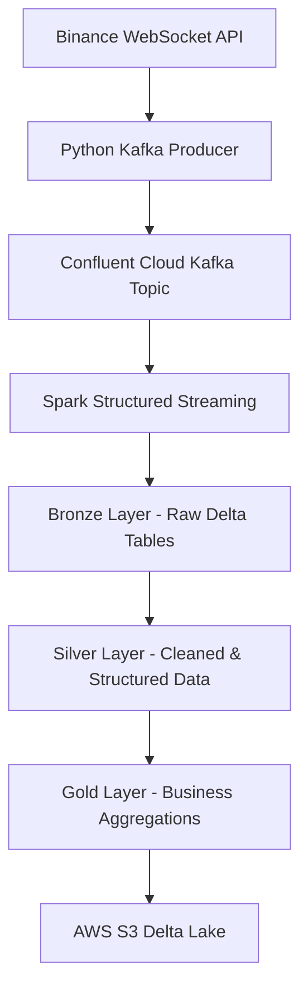

# Real-Time Crypto Lakehouse Pipeline

A production-style real-time streaming data pipeline that ingests cryptocurrency market transactions from Coinbase, streams them through Apache Kafka, and processes them using a Medallion Lakehouse Architecture with Spark Structured Streaming and Delta Lake on AWS S3.

---

# Architecture



---

# Project Overview

This project is a modern real-time data engineering workflow used in production-grade streaming systems.

The pipeline continuously ingests cryptocurrency trade events from Binance in real time, publishes them into Kafka topics, and processes them using Apache Spark Structured Streaming following the Medallion Architecture paradigm.

The final datasets are stored in Delta Lake format on Amazon S3 for scalable analytics and downstream consumption.

---

# Technologies Used

| Technology | Purpose |
|---|---|
| Apache Kafka | Real-time event streaming |
| Confluent Cloud | Managed Kafka infrastructure |
| Apache Spark | Distributed data processing |
| Spark Structured Streaming | Real-time stream processing |
| Delta Lake | ACID transactional lakehouse storage |
| AWS S3 | Cloud object storage |
| Databricks | Stream processing environment |
| Python | development |
| Coinbase WebSocket API | Real-time crypto market data |

---

# Medallion Architecture

## Bronze Layer

The Bronze layer stores raw immutable Kafka events exactly as they arrive from the source.

### Stored Metadata

| Column | Description |
|---|---|
| key | Kafka message key |
| raw_json | Raw JSON payload |
| topic | Kafka topic |
| partition | Kafka partition |
| offset | Kafka offset |
| timestamp | Kafka event timestamp |


## Silver Layer

The Silver layer transforms and validates raw Bronze data into structured analytical datasets.

| Column | Type |
|---|---|
| symbol | STRING |
| price | DOUBLE |
| quantity | DOUBLE |
| side | STRING |
| trade_id | LONG |
| timestamp | TIMESTAMP |

## Gold Layer

The Gold layer contains business-ready aggregations optimized for analytics and dashboards.

### Aggregations

- Average trade price
- Trade volume
- Buy/Sell metrics
- Market activity indicators
- Real-time analytical metrics


# Example Kafka Event

```json
{
  "symbol": "BTC-USD",
  "price": 79975.91,
  "quantity": 0.00109651,
  "side": "sell",
  "trade_id": 1015051546,
  "timestamp": "2026-05-07T23:39:48.541240Z"
}
```

---

# Data Lake Structure

```text
sebastian-crypto-lakehouse/
│
├── bronze/
│   └── crypto_transactions/
│       └── day/
│           └── hour/
│
├── silver/
│   └── crypto_transactions/
│       └── day/
│           └── hour/
├── gold/
│   └── crypto_aggregations/
│
└── checkpoints/
```

---

# Streaming Pipeline Flow

## 1. Producer Layer

A Python Kafka producer connects to the Binance WebSocket API and publishes cryptocurrency trade events into Kafka topics in real time.

---

## 2. Bronze Streaming Layer

Spark Structured Streaming consumes raw Kafka events and stores them in Delta Lake without modifying the payload.

## 3. Silver Streaming Layer

Bronze events are parsed, validated, and transformed into structured analytical datasets.

## 4. Gold Streaming Layer

Business aggregations and analytical metrics are generated from Silver datasets.


# Key Data Engineering Concepts Implemented

- Real-time streaming ingestion
- Event-driven architecture
- Kafka topic consumption
- Spark Structured Streaming
- Delta Lake ACID transactions
- Medallion Architecture
- Stream checkpointing
- Incremental processing
- Cloud lakehouse storage
- Partitioning strategies
- Schema enforcement
- Stateful stream processing
- Micro-batch processing
- Distributed data engineering

# Setup Instructions

## 1. Clone Repository

```bash
git clone https://github.com/your-username/crypto-lakehouse-pipeline.git

cd crypto-lakehouse-pipeline
```

---

## 2. Install Dependencies

```bash
pip install -r requirements.txt
```

---

## 3. Configure Environment Variables

Create a `.env` file:

```env
BOOTSTRAP_SERVERS=your_bootstrap_servers

API_KEY=your_api_key

API_SECRET=your_api_secret

TOPIC=crypto-transaction
```

---

## 4. Start Kafka Producer

```bash
python src/producers/binance_producer.py
```

---

## 5. Run Streaming Pipelines

Execute Bronze, Silver, and Gold streaming notebooks or scripts in Databricks.

---

# Delta Lake and Streaming Features Used

- ACID Transactions
- Schema Enforcement
- Time Travel Compatibility
- Streaming Writes
- Optimized Parquet Storage
- Incremental Processing
- Structured Streaming 
- Checkpointing  (Fault tolerance)
- AvailableNow Trigger
- Kafka Offsets


---

# Future Improvements

- CI/CD with GitHub Actions
- Infrastructure as Code with Terraform
- Delta Live Tables
- Real-time monitoring dashboards
- Machine learning anomaly detection
- Great Expectations data validation
- Kubernetes deployment
- Apache Airflow orchestration
- dbt transformations
- Advanced Delta optimization


# Author

Sebastián Monsalve Gómez

Data Engineering | Real-Time Streaming | Lakehouse Architectures | Big Data

